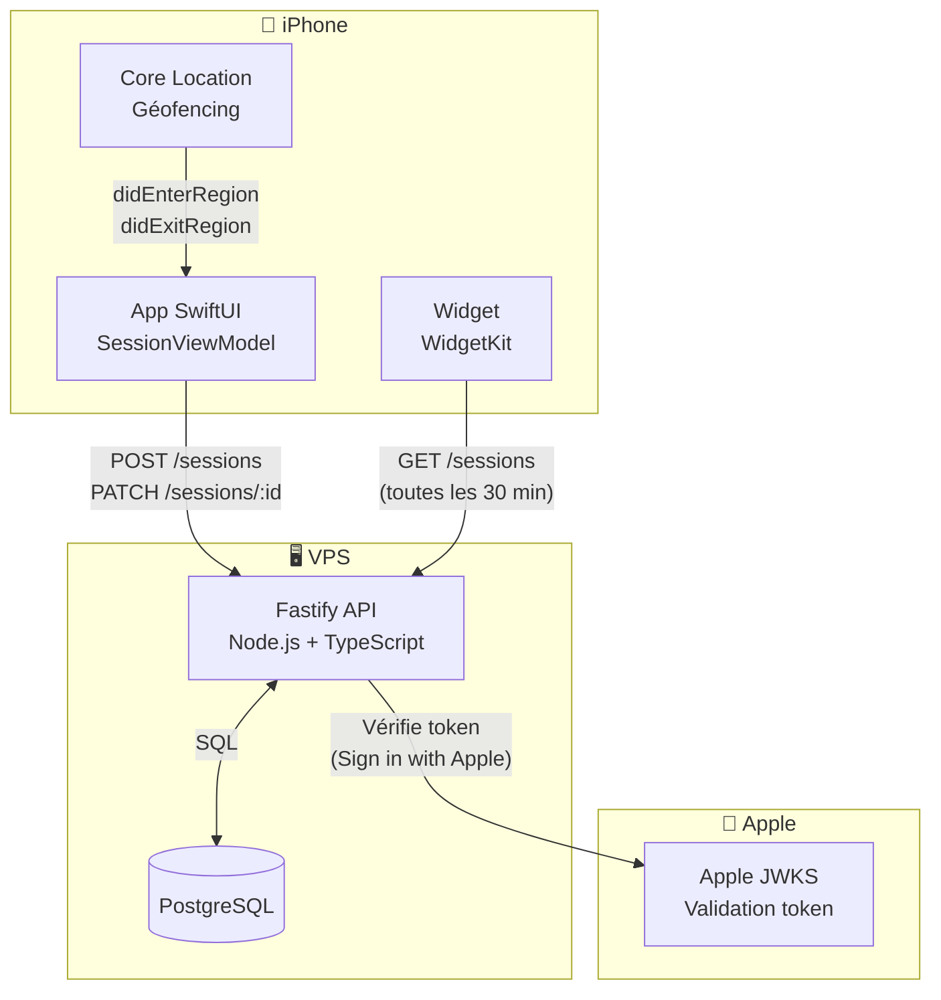
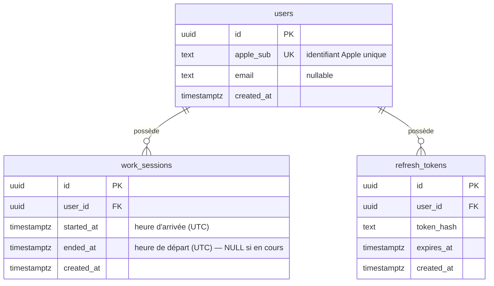
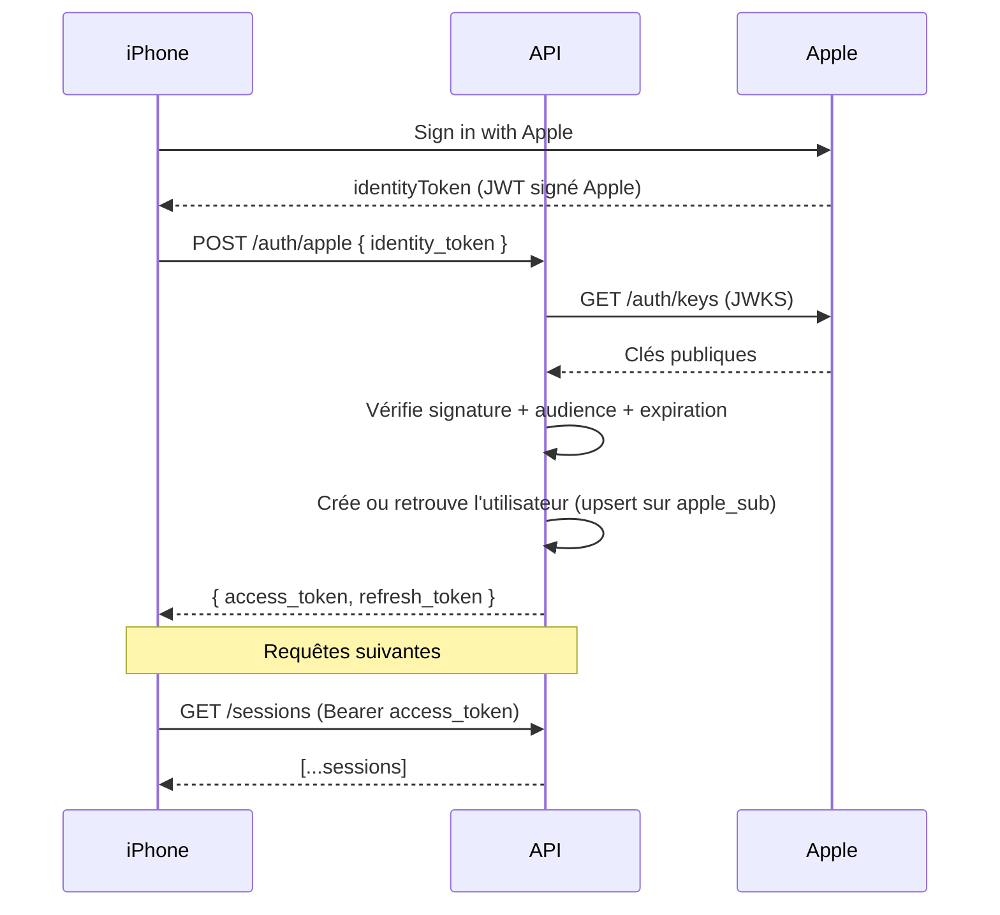
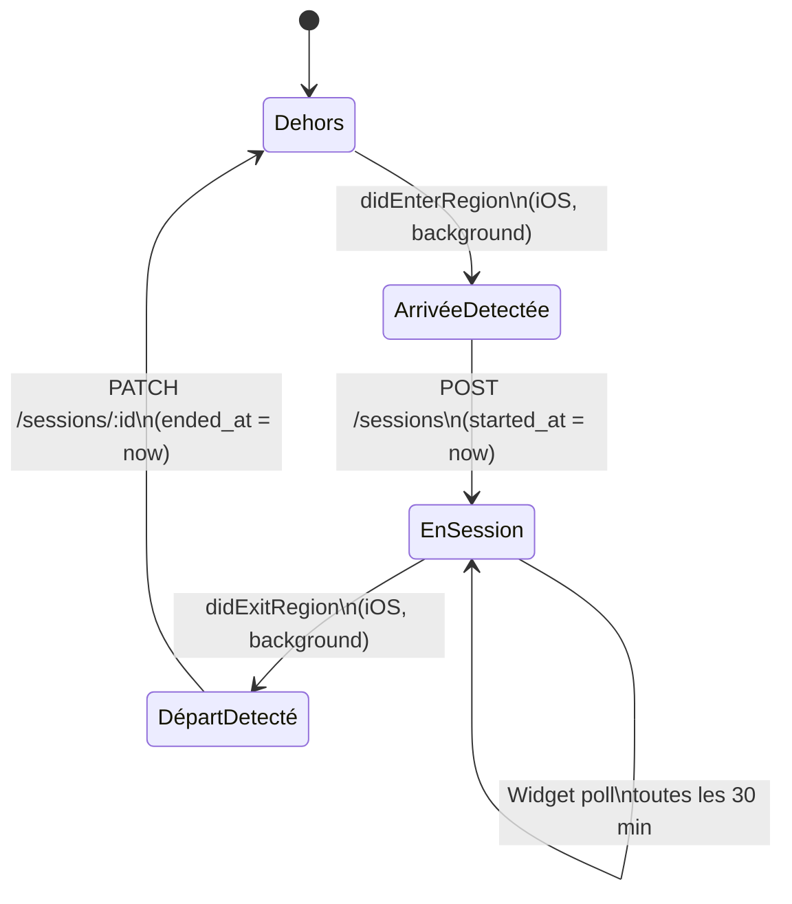

# 🕐 DeskClock

> Suivi automatique du temps de présence au bureau — backend REST, app iOS native, widget écran d'accueil.

Un projet perso exploratoire qui couvre plusieurs sujets techniques en un seul endroit : API REST typée, authentification Apple, géofencing iOS, et WidgetKit. Conçu pour une utilisation personnelle sans publication sur l'App Store.

---

## Sommaire

- [Vue d'ensemble](#vue-densemble)
- [Architecture globale](#architecture-globale)
- [Structure du monorepo](#structure-du-monorepo)
- [Stack technique](#stack-technique)
- [Modèle de données](#modèle-de-données)
- [API — endpoints](#api--endpoints)
- [Flux d'authentification](#flux-dauthentification)
- [Détection de présence (géofencing)](#détection-de-présence-géofencing)
- [Installation & lancement](#installation--lancement)
- [Roadmap](#roadmap)

---

## Vue d'ensemble

DeskClock détecte automatiquement quand tu arrives et repars du bureau, sans aucune interaction manuelle. L'iPhone surveille une zone géographique en arrière-plan ; à l'entrée et à la sortie, il ouvre une session ou la clôture via l'API. Un widget sur l'écran d'accueil affiche le récap de la semaine en temps réel.

```
┌─────────────────────────────────────────────────────────┐
│  Tu arrives au bureau                                   │
│  → iPhone détecte la zone géographique                  │
│  → App envoie POST /sessions au backend                 │
│  → Widget se rafraîchit, affiche l'heure d'arrivée      │
│                                                         │
│  Tu repars                                              │
│  → iPhone détecte la sortie de zone                     │
│  → App envoie PATCH /sessions/:id                       │
│  → Widget affiche la durée de la journée                │
└─────────────────────────────────────────────────────────┘
```

---

## Roadmap

- [x] Architecture & schéma de données
- [ ] Backend — auth Apple + CRUD sessions
- [ ] Backend — tests d'intégration (Vitest)
- [ ] App iOS — affichage et clock-in/out manuel
- [ ] App iOS — géofencing Core Location
- [ ] Widget WidgetKit
- [ ] CI GitHub Actions (lint, tests, build Docker)

---

## IA & process

Ce projet est aussi une expérimentation volontaire de **Claude** (Anthropic, version gratuite,
interface chat) comme outil de développement. L'objectif : passer moins de temps sur la
documentation et la recherche pour me concentrer sur l'apprentissage — notamment le dev natif
Apple qui est nouveau pour moi. Toutes les décisions restent relues, comprises et assumées.

---

## Licence

MIT — projet personnel, usage libre.

---

## Architecture globale



---

## Structure du monorepo

```
todo
```

---

## Stack technique

| Couche | Technologie | Pourquoi |
|--------|-------------|----------|

todo

---

## Modèle de données



> **Note :** tout est stocké en UTC (`TIMESTAMPTZ`). L'app iOS applique le fuseau horaire local à l'affichage. On évite ainsi tous les bugs lors des changements d'heure.

---

## API — endpoints

```
Base URL : https://api.your-vps.com/v1
Auth     : Bearer <jwt> dans le header Authorization (sauf /auth/apple)
```

| Méthode | Route | Description |
|---------|-------|-------------|
| `POST` | `/auth/apple` | Échange un token Apple contre un JWT + refresh token |
| `POST` | `/auth/refresh` | Renouvelle le JWT avec un refresh token valide |
| `GET` | `/me` | Profil de l'utilisateur connecté |
| `POST` | `/sessions` | Clock-in — ouvre une nouvelle session |
| `PATCH` | `/sessions/:id` | Clock-out — ferme une session existante |
| `GET` | `/sessions` | Liste les sessions (`?from=ISO8601&to=ISO8601`) |
| `DELETE` | `/sessions/:id` | Supprime une session (correction d'erreur) |

### Exemple — POST /sessions

```http
POST /v1/sessions
Authorization: Bearer eyJ...
Content-Type: application/json

{
  "started_at": "2025-06-10T08:42:00+02:00"
}
```

```json
{
  "id": "c1f2e3d4-...",
  "user_id": "a0b1c2d3-...",
  "started_at": "2025-06-10T06:42:00Z",
  "ended_at": null,
  "created_at": "2025-06-10T06:42:01Z"
}
```

---

## Flux d'authentification



---

## Détection de présence (géofencing)



Core Location surveille une zone circulaire (`CLCircularRegion`) autour du bureau. iOS réveille l'app en background à l'entrée et à la sortie — sans GPS continu, donc sans impact notable sur la batterie. Le rayon recommandé est de **50 à 100 mètres**.

---

## Installation & lancement

### Prérequis

todo

### Backend en local

```bash
# Cloner le repo
git clone https://github.com/<toi>/deskclock.git
cd deskclock

# Variables d'environnement
cp .env.example .env
# → Renseigner DATABASE_URL, JWT_SECRET, APPLE_CLIENT_ID

# Démarrer PostgreSQL
docker compose up -d postgres

# Installer les dépendances et lancer les migrations
cd apps/api
npm install
npm run migrate:up

# Lancer en dev (hot reload)
npm run dev
# → http://localhost:3000
```

### Déploiement VPS

```bash
# Sur le VPS
docker compose -f docker-compose.prod.yml up -d
```

### App iOS

1. Ouvrir `apps/ios/DeskClock.xcodeproj` dans Xcode
2. Sélectionner ton iPhone comme cible
3. Renseigner l'URL de l'API dans `Config.swift`
4. `⌘R` pour compiler et installer

> **Sans Apple Developer Program :** le certificat expire tous les 7 jours. Re-signer en rebranchant l'iPhone et en relançant `⌘R`, ou utiliser [AltStore](https://altstore.io/) pour la re-signature automatique via Wi-Fi.
