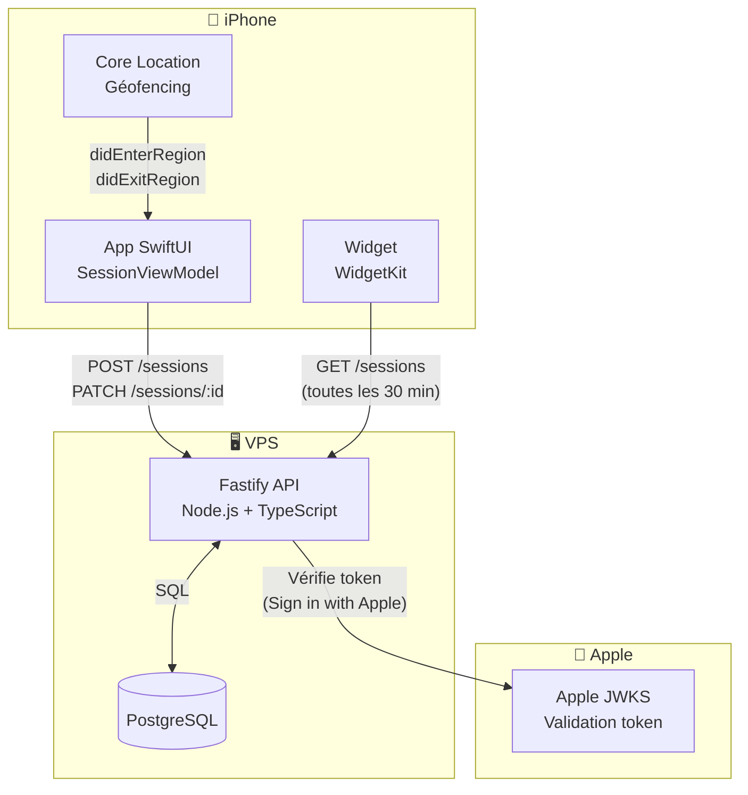
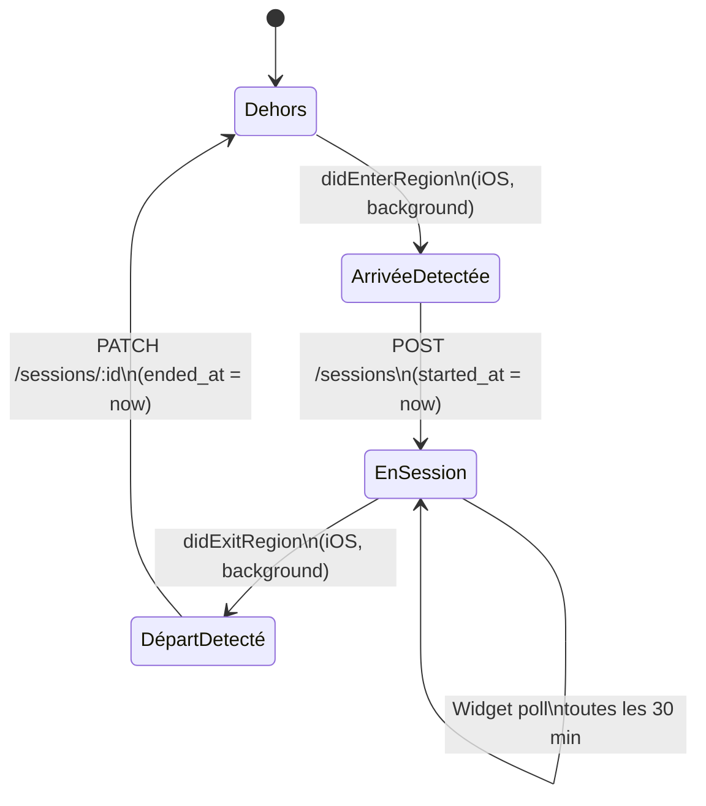

# 🕐 DeskClock

> Suivi automatique du temps de présence au bureau — backend REST, app iOS native, widget écran d'accueil.

Un projet perso exploratoire qui couvre plusieurs sujets techniques en un seul endroit : API REST typée, authentification Apple, géofencing iOS, et WidgetKit. Conçu pour une utilisation personnelle sans publication sur l'App Store.

---

## Sommaire

- [Vue d'ensemble](#vue-densemble)
- [Architecture globale](#architecture-globale)
- [Stack technique](#stack-technique)
- [Détection de présence (géofencing)](#détection-de-présence-géofencing)
- [Installation & lancement](#installation--lancement)

---

## Vue d'ensemble

DeskClock détecte automatiquement quand tu arrives et repars du bureau, sans aucune interaction manuelle. L'iPhone surveille une zone géographique en arrière-plan ; à l'entrée et à la sortie, il ouvre une session ou la clôture via l'API. Un widget sur l'écran d'accueil affiche le récap de la semaine en temps réel.

```
┌─────────────────────────────────────────────────────────┐
│  Tu arrives au bureau                                   │
│  → iPhone détecte la zone géographique                  │
│  → App envoie POST /sessions au backend                 │
│  → Widget se rafraîchit, affiche l'heure d'arrivée      │
│                                                         │
│  Tu repars                                              │
│  → iPhone détecte la sortie de zone                     │
│  → App envoie PATCH /sessions/:id                       │
│  → Widget affiche la durée de la journée                │
└─────────────────────────────────────────────────────────┘
```

---

## Architecture globale



---

## Stack technique

| Couche | Technologie | Pourquoi |
|--------|-------------|----------|
| **Runtime** | Node.js 22 + TypeScript | Typage strict, async/await natif |
| **Framework HTTP** | Fastify 5 | Perf supérieure à Express, validation JSON intégrée |
| **Validation** | Zod | Schémas colocalisés avec les types TypeScript |
| **Base de données** | PostgreSQL 16 | TIMESTAMPTZ natif, fiable, SQL standard |
| **Driver DB** | postgres.js | Pool de connexions, tagged template literals |
| **Migrations** | node-pg-migrate | Versionnées, réversibles |
| **Auth** | Sign in with Apple + JWT | Standard iOS, pas de mot de passe à gérer |
| **iOS** | SwiftUI + Swift 5.10 | Framework actuel Apple, déclaratif |
| **Widget** | WidgetKit | Écran d'accueil et Dynamic Island |
| **Géofencing** | Core Location | Détection en background, faible consommation |
| **Déploiement** | Docker + VPS | Contrôle total, zéro coût cloud |

---

## Détection de présence (géofencing)



Core Location surveille une zone circulaire (`CLCircularRegion`) autour du bureau. iOS réveille l'app en background à l'entrée et à la sortie — sans GPS continu, donc sans impact notable sur la batterie. Le rayon recommandé est de **50 à 100 mètres**.

---

## Installation & lancement

### Prérequis

todo

### Backend en local

```bash
# Cloner le repo
git clone https://github.com/OscarPALISSOT/DeskClock.git
cd deskclock

# Variables d'environnement
cp .env.example .env
# → Renseigner DATABASE_URL, JWT_SECRET, APPLE_CLIENT_ID


todo
```

### Déploiement VPS

```bash
# Sur le VPS
todo
```

### App iOS

todo

> **Sans Apple Developer Program :** le certificat expire tous les 7 jours. Re-signer en rebranchant l'iPhone et en relançant `⌘R`, ou utiliser [AltStore](https://altstore.io/) pour la re-signature automatique via Wi-Fi.

---

## IA & process

Ce projet est aussi une expérimentation volontaire de **Claude** (Anthropic, version gratuite,
interface chat) comme outil de développement. L'objectif : passer moins de temps sur la
documentation et la recherche pour me concentrer sur l'apprentissage — notamment le dev natif
Apple qui est nouveau pour moi. Toutes les décisions restent relues, comprises et assumées.

---

## Licence

MIT — projet personnel, usage libre.