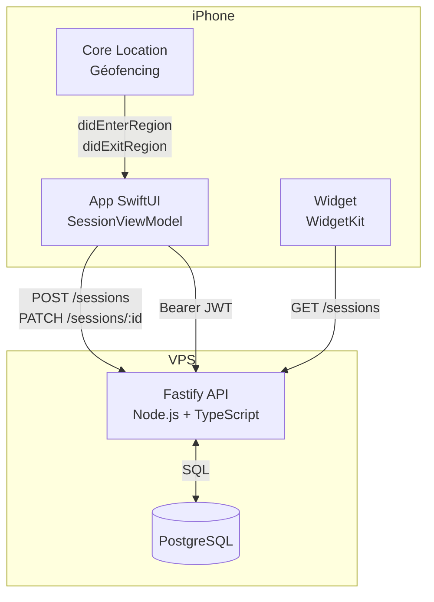
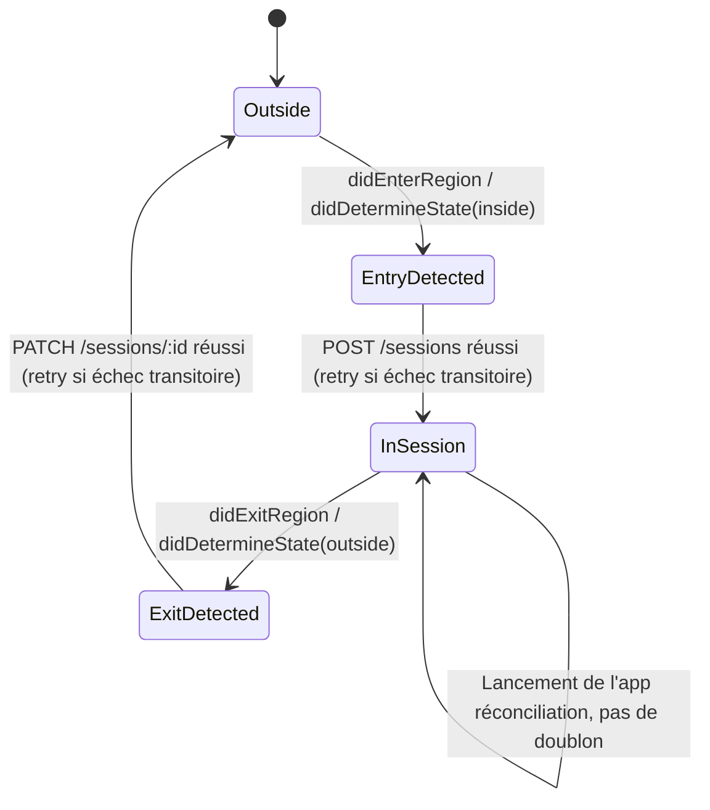

# 🕐 DeskClock

> Suivi automatique du temps de présence au bureau — backend REST, app iOS native, widget écran d'accueil.

Un projet perso exploratoire qui couvre plusieurs sujets techniques en un seul endroit : API REST typée, authentification Apple, géofencing iOS, et WidgetKit. Conçu pour une utilisation personnelle sans publication sur l'App Store.

---

## Sommaire

- [Vue d'ensemble](#vue-densemble)
- [Architecture globale](#architecture-globale)
- [Stack technique](#stack-technique)
- [Détection de présence (géofencing)](#détection-de-présence-géofencing)

---

## Vue d'ensemble

DeskClock détecte automatiquement quand tu arrives et repars du bureau, sans aucune interaction manuelle. L'iPhone surveille une zone géographique en arrière-plan ; à l'entrée et à la sortie, il ouvre une session ou la clôture via l'API. Un widget sur l'écran d'accueil affiche le récap de la semaine en temps réel.

```
┌─────────────────────────────────────────────────────────┐
│ Arrivée au bureau                                       │
│ → Détection de la zone géographique par l'iPhone        │
│ → Envoi de POST /sessions au backend                    │
│ → Widget rafraîchi, heure d'arrivée affichée            │
│                                                         │
│ Départ du bureau                                        │
│ → Détection de la sortie de zone par l'iPhone           │
│ → Envoi de PATCH /sessions/:id                          │
│ → Durée de la journée affichée sur le widget            │
└─────────────────────────────────────────────────────────┘
```

---

## Architecture globale


```mermaid
graph TB
    subgraph iPhone["iPhone"]
        CL["Core Location\nGéofencing"]
        APP["App SwiftUI\nSessionViewModel"]
        WGT["Widget\nWidgetKit"]
    end

    subgraph VPS["VPS"]
        API["Fastify API\nNode.js + TypeScript"]
        DB[("PostgreSQL")]
    end

    CL -->|"didEnterRegion\ndidExitRegion"| APP
    APP -->|"POST /sessions\nPATCH /sessions/:id"| API
    APP -->|"Bearer JWT"| API
    WGT -->|"GET /sessions"| API
    API <-->|"SQL"| DB
```

---

## Stack technique

| Couche | Technologie |
|--------|-------------|
| Backend | Node.js, Fastify 5, TypeScript |
| Base de données | PostgreSQL |
| Auth | JWT (email / mot de passe) |
| iOS | Swift, SwiftUI |
| Géofencing | Core Location |
| Widget | WidgetKit (à venir) |
| Déploiement | Docker, VPS |

---

## Détection de présence (géofencing)


```mermaid
stateDiagram-v2
    [*] --> Outside

    Outside --> EntryDetected: didEnterRegion / didDetermineState(inside)
    EntryDetected --> InSession: POST /sessions réussi (retry si échec transitoire)
    InSession --> ExitDetected: didExitRegion / didDetermineState(outside)
    ExitDetected --> Outside: PATCH /sessions/:id réussi (retry si échec transitoire)

    InSession --> InSession: Lancement de l'app réconciliation, pas de doublon
```

Core Location surveille une zone circulaire (`CLCircularRegion`) autour du bureau. iOS réveille l'app en arrière-plan à l'entrée et à la sortie — sans GPS continu, donc sans impact notable sur la batterie. Rayon retenu : 80 mètres.

Chaque tentative de clock-in/clock-out dispose de nouvelles tentatives bornées en cas d'échec transitoire (réseau, token), dans la fenêtre accordée par la background task assertion. Le détail de cette logique est documenté dans le [README de l'app iOS](apps/ios/README.md).


> **Sans Apple Developer Program :** le certificat expire tous les 7 jours. Re-signer en rebranchant l'iPhone et en relançant `⌘R`, ou utiliser [AltStore](https://altstore.io/) pour la re-signature automatique via Wi-Fi.

---

## IA & process

Ce projet est aussi une expérimentation volontaire de **Claude** (Anthropic, version gratuite,
interface chat) comme outil de développement. Toutes les décisions restent relues, comprises et assumées.

---

## Licence

MIT — projet personnel, usage libre.