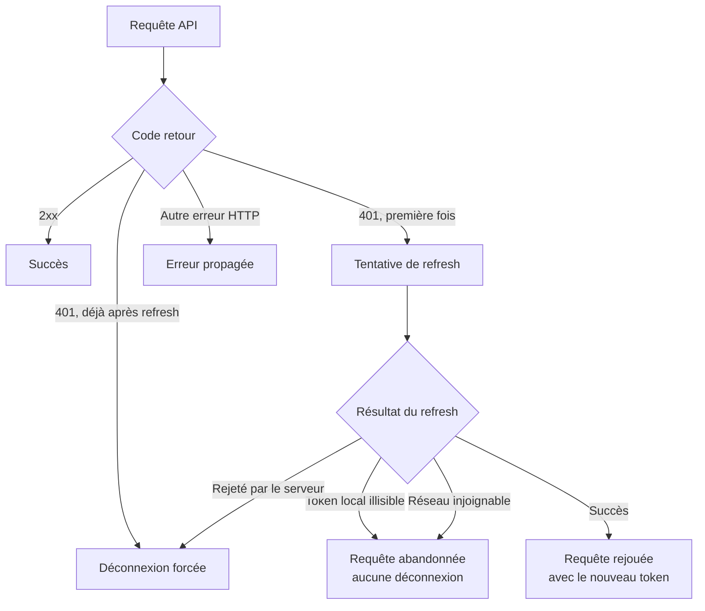
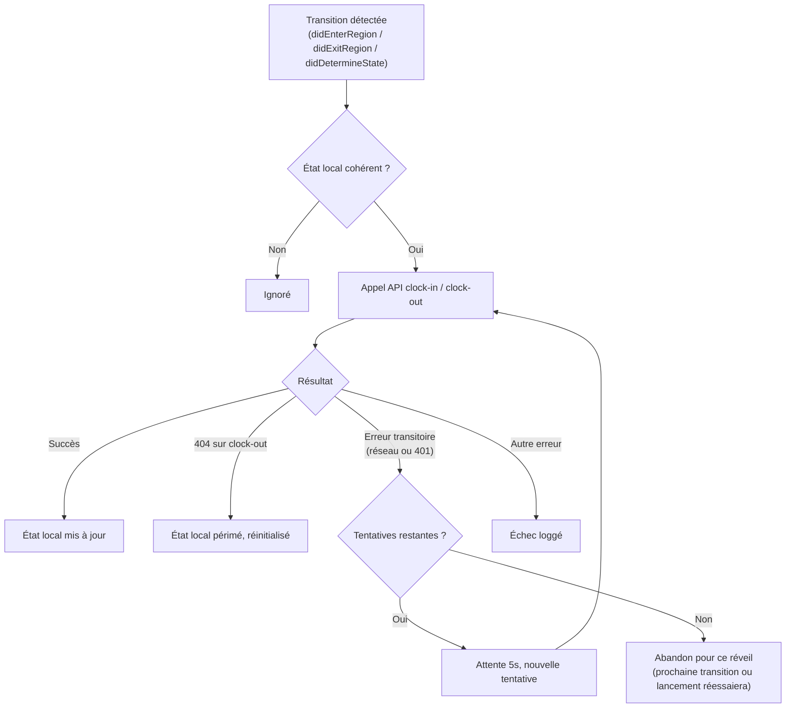

# DeskClock — iOS

> SwiftUI · Core Location · WidgetKit (à venir)

Application iOS de DeskClock. Détecte automatiquement les arrivées et départs du bureau via géofencing, et communique avec le backend pour ouvrir/fermer les sessions de présence.

→ [README global du projet](../../README.md)

---

## Sommaire

- [Stack](#stack)
- [Gestion des erreurs](#gestion-des-erreurs)

---

## Stack

| Couche | Technologie |
|--------|-------------|
| UI | SwiftUI |
| Géofencing | Core Location |
| Stockage sécurisé | Keychain |
| Widget | WidgetKit (à venir) |

---

## Gestion des erreurs

### Requêtes API et renouvellement automatique du token

Un `401` déclenche une tentative de renouvellement avant d'abandonner. Seul un refus explicite du serveur (refresh token invalide ou déjà utilisé) provoque une déconnexion — une impossibilité locale de lire le token, ou un problème réseau, n'entraîne jamais de déconnexion.

### Clock-in / clock-out en arrière-plan

Chaque tentative dispose de deux nouvelles tentatives espacées de 5 secondes en cas d'échec transitoire, dans la fenêtre accordée par la background task assertion. Un `404` sur une fermeture de session signale un état local périmé (session déjà fermée ou supprimée côté serveur) : il est réinitialisé plutôt que de bloquer indéfiniment les entrées suivantes.