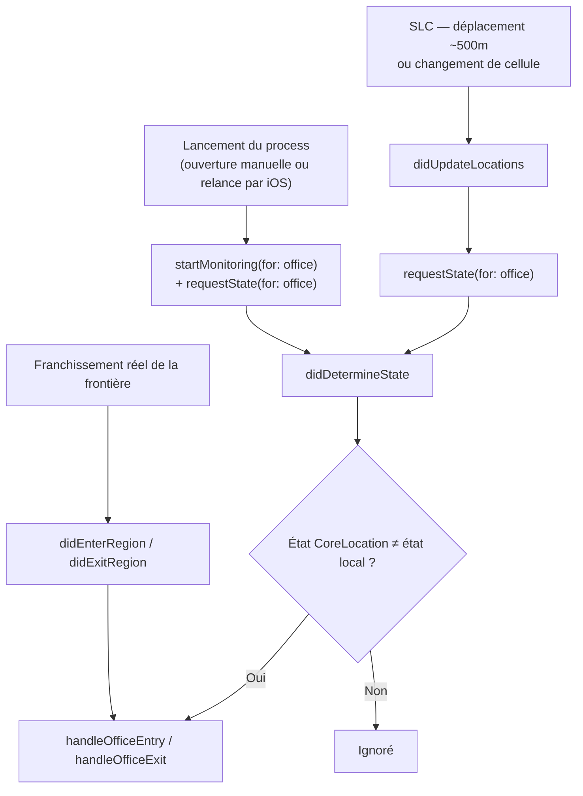
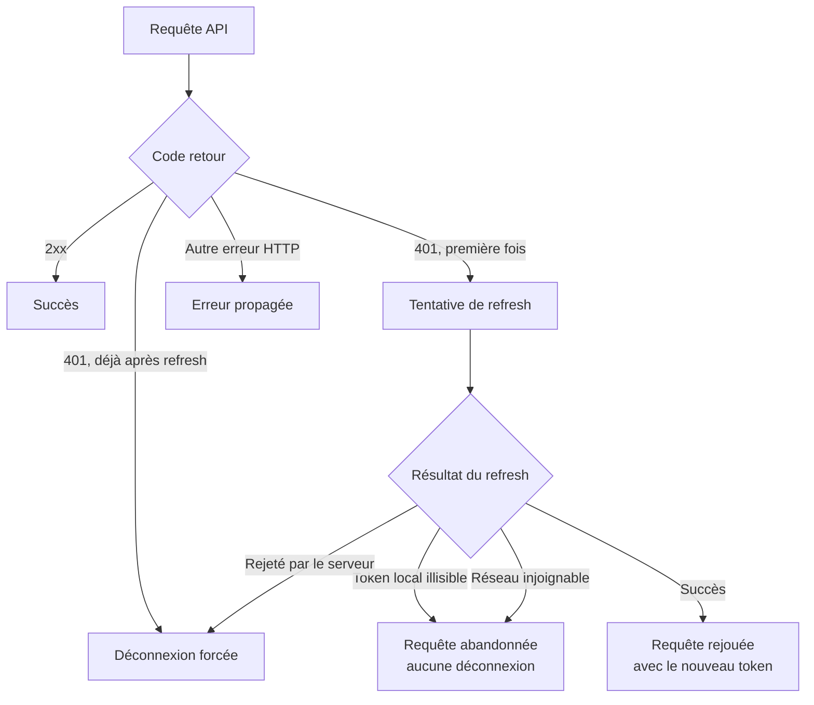
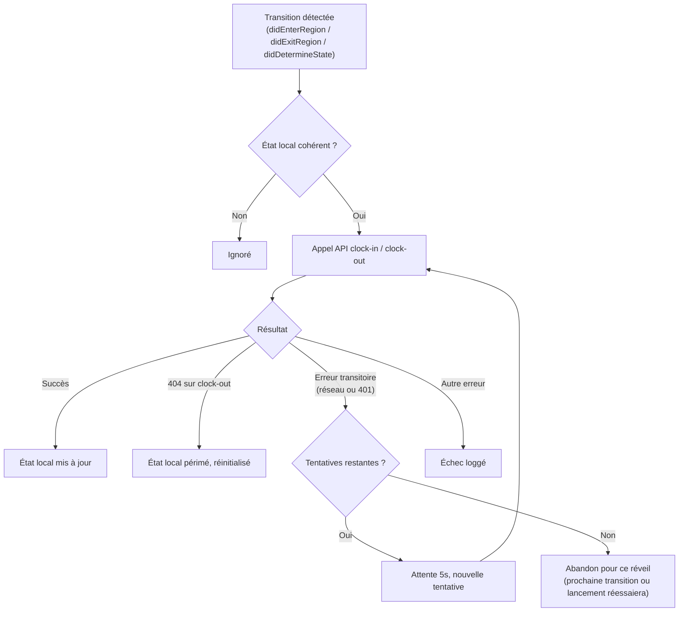

# DeskClock — iOS

> SwiftUI · Core Location · WidgetKit (à venir)

Application iOS de DeskClock. Détecte automatiquement les arrivées et départs du bureau via géofencing, et communique avec le backend pour ouvrir/fermer les sessions de présence.

→ [README global du projet](../../README.md)

---

## Sommaire

- [Stack](#stack)
- [Fiabilité du géofencing](#fiabilité-du-géofencing)
- [Gestion des erreurs](#gestion-des-erreurs)

---

## Stack

| Couche | Technologie |
|--------|-------------|
| UI | SwiftUI |
| Géofencing | Core Location |
| Stockage sécurisé | Keychain |
| Widget | WidgetKit (à venir) |

---

## Fiabilité du géofencing

Le region monitoring (`CLCircularRegion`) est réenregistré à chaque lancement du process — manuel ou relance par iOS suite à un événement de localisation. `locationManagerDidChangeAuthorization` est appelé dès l'assignation du delegate, y compris lorsque le statut n'a pas changé ; ce n'est pas un signal fiable de changement réel, seulement du statut courant.

Le suivi des changements significatifs de position (SLC) sert de déclencheur actif complémentaire aux événements de franchissement de frontière (`didEnterRegion`/`didExitRegion`) : chaque réveil SLC force une vérification d'état via `requestState(for:)`, indépendamment d'un franchissement détecté ou d'une réouverture manuelle de l'app.

Objectif : réduire le délai entre un changement de présence réel et sa détection, en particulier après une longue période d'inactivité du sous-système de localisation (nuit, week-end), sans dépendre d'une réouverture manuelle de l'app pour corriger l'état.

---

## Gestion des erreurs

### Requêtes API et renouvellement automatique du token

Un `401` déclenche une tentative de renouvellement avant d'abandonner. Seul un refus explicite du serveur (refresh token invalide ou déjà utilisé) provoque une déconnexion — une impossibilité locale de lire le token, ou un problème réseau, n'entraîne jamais de déconnexion.

### Clock-in / clock-out en arrière-plan

Chaque tentative dispose de deux nouvelles tentatives espacées de 5 secondes en cas d'échec transitoire, dans la fenêtre accordée par la background task assertion. Un `404` sur une fermeture de session signale un état local périmé (session déjà fermée ou supprimée côté serveur) : il est réinitialisé plutôt que de bloquer indéfiniment les entrées suivantes.